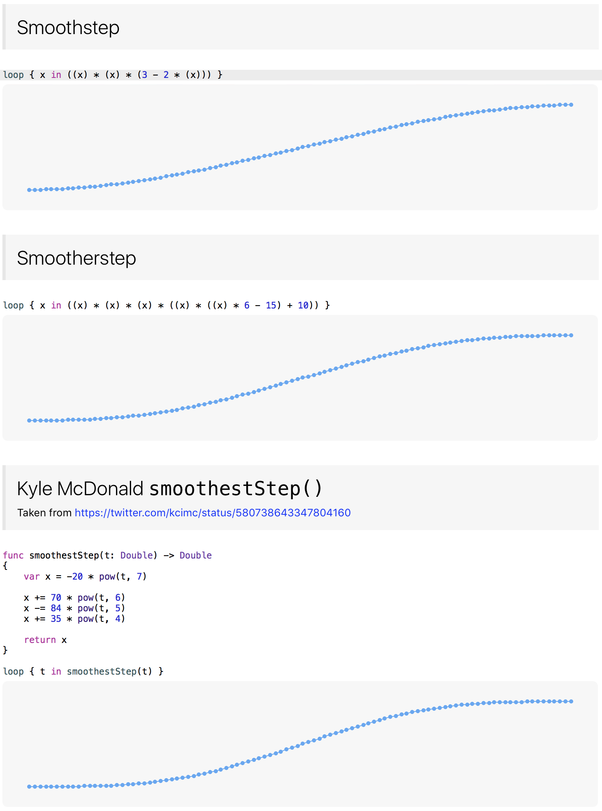

# Interpolation-Playground
Swift playground demonstrating lerp, smooth step, Catmull-Rom and others!

List of interpolations

* Linear Interpolation
* Smooth Step
* Smoother Step
* Smoothest Step
* Squared
* Inverse Squared
* Cubed
* Sin
* Catmull-Rom
* Elastic In
* Elastic Out
* Wobble
* Gaussian

Feel free to raise a PR to add your own!
